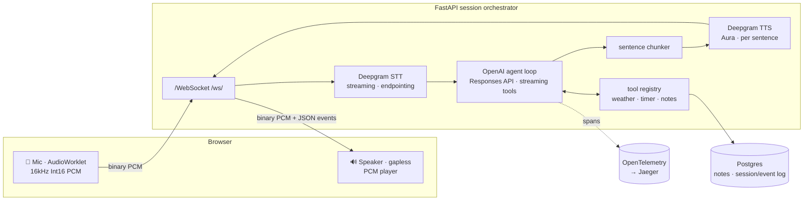

# Voice Assistant

A real-time, tool-using voice assistant. Talk to it in the browser; it streams your
speech to text, reasons with an LLM (calling tools like weather lookups, web search,
timers, and notes along the way), and speaks its answer back — all over a single
WebSocket, sentence by sentence, with sub-2-second voice-to-voice latency.

> 🚧 Under active development. See [Roadmap](#roadmap) for build status.


<!--  -->

## Architecture



### Latency budget (voice-to-voice)

Target: **under ~2 s** from end-of-speech to first audio out.

| Stage | Signal | Budget | Measured |
|---|---|---:|---|
| Endpointing | speech end → `stt_final` | ~300 ms | Deepgram `endpointing=300` |
| LLM first token | `stt_final` → first `assistant_delta` | ~0.9 s | ~0.85 s (gpt-5-mini, minimal reasoning) |
| First sentence | first delta → sentence boundary | ~0.1 s | chunker, inline |
| TTS first audio | sentence → first PCM frame | ~0.3 s | Deepgram Aura REST, per sentence |
| **Total** | speech end → first audio | **~1.6 s** | within the sub-2 s target |

Numbers are from live end-to-end runs recorded in `HANDOFF.md`; TTS/first-audio
is a representative single-sentence figure. Re-measure with `scripts/ws_client.py`
(timestamps every event).

## Design Decisions

- **AudioWorklet, not MediaRecorder** — Deepgram wants raw `linear16`; a worklet
  emits 16 kHz mono Int16 PCM at ~40 ms granularity, far tighter than
  MediaRecorder's practical chunking, so turn latency stays low.
- **Sentence-chunked REST TTS, not the TTS WebSocket** — synthesizing per
  sentence lets the first sentence start playing while the LLM is still
  generating the rest; a pure sync chunker feeds an `asyncio.Queue` consumed by
  one ordered TTS worker (pipelining without threads).
- **Manual streaming tool loop, not the SDK tool-runner** — streaming per-token
  text *and* executing tools mid-stream doesn't compose with the built-in
  runner. The loop consumes Responses stream events, runs tool calls in
  parallel, feeds one `function_call_output` per call back, and caps at 6
  iterations. Tool exceptions become error text — the loop never crashes.
- **Client-owned conversation state (`store=False`)** — the app keeps the
  `input` item list itself, so a session is fully serializable. That's what
  makes Phase 6 event-log replay an architectural freebie. Oldest whole turns
  past a 40-item cap are trimmed, never the system prompt.
- **Provider seam** — STT/TTS are thin async `Protocol`s; the Deepgram SDK never
  leaks past `providers/`. Swap vendors by implementing two classes.
- **Barge-in with a self-echo guard** — the mic stays open while speaking;
  genuine interims cancel the turn and flush audio, while the assistant's own
  TTS leaking back through the mic is scored and dropped (see
  `docs/bug-self-barge-in-echo.md`).
- **Event sourcing** — every server→client event flows through one `emit()`
  seam; the frontend live UI is a pure reducer over that stream, so Phase 6
  Replay reuses the exact same reducer at recorded or scaled timing.
- **Reliability** — Deepgram STT auto-reconnects (bounded) on a mid-conversation
  drop; the WebSocket loop tears down STT/TTS/timers on any disconnect.

## Quickstart

```bash
cp .env.example .env   # fill in OPENAI_API_KEY and DEEPGRAM_API_KEY; this is the
                        # only .env the app reads (backend resolves it by
                        # absolute path regardless of cwd) — don't add another
make db-up              # start Postgres (and Jaeger, with --profile observability)
make migrate
make dev-backend         # FastAPI on :8000
make dev-frontend        # Vite on :5173
```

## Testing

```bash
make test       # backend pytest suite (mocked externals, no API keys required)
make lint       # ruff + tsc
```

## Roadmap

- [x] Phase 0 — Scaffold
- [x] Phase 1 — Text chat loop end-to-end
- [x] Phase 2 — Voice in (STT)
- [x] Phase 3 — Voice out + barge-in
- [x] Phase 4 — Tools
- [x] Phase 5 — Polish
- [ ] Phase 6 — Event Timeline + Replay

## License

MIT — see [LICENSE](LICENSE).
