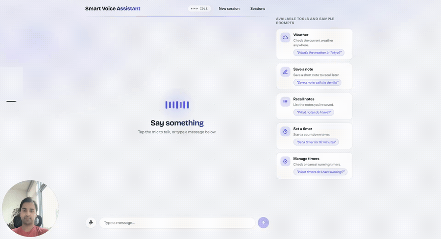
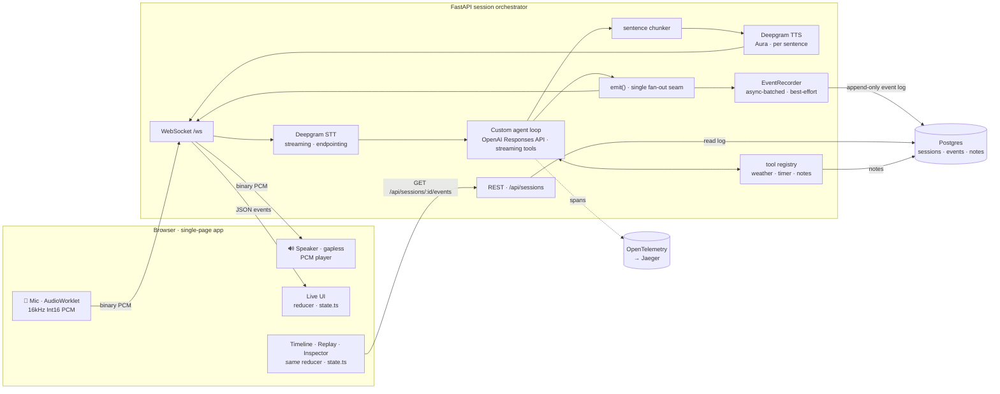

# Voice Assistant

A real-time, tool-using voice assistant. Talk to it in the browser; it streams your
speech to text, reasons with an LLM (calling tools like weather lookups, timers, and
notes along the way), and speaks its answer back — all over a single WebSocket,
sentence by sentence, with sub-2-second voice-to-voice latency.

Every session is captured as an append-only event log, so any conversation can be
[replayed](#timeline--replay) turn-by-turn against a latency timeline and a raw
event inspector — the live UI and the replay share the exact same reducer.

> 🚧 Under active development. See [Roadmap](#roadmap) for build status.


<!--  -->

## Architecture

The **live path** (solid, left-to-right) carries voice; the **replay path**
(reading back from the event log) reuses the *exact same reducer* as the live
UI — that reuse is the payoff of routing every server→client event through one
`emit()` seam.



### Latency budget (voice-to-voice)

Target: **under ~2 s** from end-of-speech to first audio out.

| Stage | Signal | Budget | Measured |
|---|---|---:|---|
| Endpointing | speech end → `stt_final` | ~300 ms | Deepgram `endpointing=300` |
| LLM first token | `stt_final` → first `assistant_delta` | ~0.9 s | ~0.85 s (gpt-5-mini, minimal reasoning) |
| First sentence | first delta → sentence boundary | ~0.1 s | chunker, inline |
| TTS first audio | sentence → first PCM frame | ~0.3 s | Deepgram Aura REST, per sentence |
| **Total** | speech end → first audio | **~1.6 s** | within the sub-2 s target |

TTS/first-audio is a representative single-sentence figure. Re-measure with `scripts/ws_client.py`
(timestamps every event).

## Design Decisions

- **AudioWorklet, not MediaRecorder** — Deepgram wants raw `linear16`; a worklet
  emits 16 kHz mono Int16 PCM at ~40 ms granularity, far tighter than
  MediaRecorder's practical chunking, so turn latency stays low.
- **Sentence-chunked REST TTS, not the TTS WebSocket** — synthesizing per
  sentence lets the first sentence start playing while the LLM is still
  generating the rest; a pure sync chunker feeds an `asyncio.Queue` consumed by
  one ordered TTS worker (pipelining without threads).
- **Manual streaming tool loop, not the SDK tool-runner** — streaming per-token
  text *and* executing tools mid-stream doesn't compose with the built-in
  runner. The loop consumes Responses stream events, runs tool calls in
  parallel, feeds one `function_call_output` per call back, and caps at 6
  iterations. Tool exceptions become error text — the loop never crashes.
- **Client-owned conversation state (`store=False`)** — the app keeps the
  `input` item list itself, so a session is fully serializable. That's what
  makes Phase 6 event-log replay an architectural freebie. Oldest whole turns
  past a 40-item cap are trimmed, never the system prompt.
- **Provider seam** — STT/TTS are thin async `Protocol`s; the Deepgram SDK never
  leaks past `providers/`. Swap vendors by implementing two classes.
- **Barge-in with a self-echo guard** — the mic stays open while speaking;
  genuine interims cancel the turn and flush audio, while the assistant's own
  TTS leaking back through the mic is scored and dropped (see
  `docs/bug-self-barge-in-echo.md`).
- **Event sourcing** — every server→client event flows through one `emit()`
  seam; the frontend live UI is a pure reducer over that stream, so Phase 6
  Replay reuses the exact same reducer at recorded or scaled timing.
- **Reliability** — Deepgram STT auto-reconnects (bounded) on a mid-conversation
  drop; the WebSocket loop tears down STT/TTS/timers on any disconnect.

## Timeline & Replay

Every conversation is an append-only event log. The same `emit()` seam that
streams events to the browser also hands each one to an async `EventRecorder`
that persists it to Postgres (`sessions` + `events` tables) with its
`turn_id` and OTel `trace_id`/`span_id`. Recording is best-effort — if the DB
is unreachable the recorder self-disables and the live conversation is
unaffected.

A routed UI reads that log back over `GET /api/sessions` and
`GET /api/sessions/:id/events`. At `/sessions/:id` three panels render over
the recorded events:

- **Timeline** — a per-turn Gantt chart on a shared absolute time axis:
  listening → thinking → speaking phases, with `tool` sub-spans (matched by
  `call_id`) and speaking capped at barge-in cancels.
- **Replay** — play/pause, 1×/2×/4×, and a scrubber that reproduce the
  conversation at any cursor. Replay works by folding the recorded event
  payloads through the **exact same pure reducer that drives the live UI**
  (`state.ts`), reused verbatim — that reducer-reuse is the whole reason the
  conversation state is event-sourced.
- **Event Inspector** — the raw event list with a JSON payload pane, including
  the `llm_request` snapshot (the exact `input` list sent to the model each
  agent-loop iteration).

Design + implementation notes:
[design spec](docs/superpowers/specs/2026-07-12-phase-6-timeline-replay-design.md)
and [plan](docs/superpowers/plans/2026-07-12-phase-6-timeline-replay.md).

## Quickstart

```bash
cp .env.example .env   # fill in OPENAI_API_KEY and DEEPGRAM_API_KEY; this is the
                        # only .env the app reads (backend resolves it by
                        # absolute path regardless of cwd) — don't add another
make up                  # start Postgres + Jaeger via docker compose
make migrate
make dev-backend         # FastAPI on :8000
make dev-frontend        # Vite on :5173
```

Then open http://localhost:5173 and talk (or type) to the assistant.

### Try the Replay

The Timeline and Replay are views over *recorded* conversations, so there's one
extra step beyond starting the app: put a conversation on record.

1. **Have a conversation** on the Live page (`/`) — every event is persisted to
   Postgres as it streams. (`make up` + `make migrate` are what make this
   work: without a reachable DB the recorder self-disables, the live call is
   unaffected, but nothing is saved to replay.)
2. **Open the Sessions view** — click **Sessions** in the nav (or go to
   `/sessions`), pick a session, and `/sessions/:id` renders the **Timeline**,
   **Replay** (play/pause · 1×/2×/4× · scrubber), and **Event Inspector**.

A session shows up the moment it starts and is replayable *while it's still
live* — events are persisted as they stream, so you don't have to end the call
first. Closing or reloading the tab just adds the finishing touches: the
session's title (its first utterance) and its end time are written on teardown,
so an in-progress session simply lists untitled until then.

### See the traces

`make up` starts Jaeger alongside Postgres. Point the app at it by setting
`OTEL_EXPORTER_OTLP_ENDPOINT=http://localhost:4318` in `.env` and restarting
the backend.

Each turn then emits a `turn` span with nested `llm.request`, `tool.execute`,
and `tts.synthesize` spans that surface in the Jaeger UI
(http://localhost:16686) as the conversation runs — no need to end the session.
Leave the endpoint empty to skip exporting and just print spans to the backend
console instead.

## Testing

```bash
make test       # backend pytest suite (mocked externals, no API keys required)
make lint       # ruff + tsc
```

## Roadmap

- [x] Phase 0 — Scaffold
- [x] Phase 1 — Text chat loop end-to-end
- [x] Phase 2 — Voice in (STT)
- [x] Phase 3 — Voice out + barge-in
- [x] Phase 4 — Tools
- [x] Phase 5 — Polish
- [x] Phase 6 — Event Timeline + Replay

## License

MIT — see [LICENSE](LICENSE).
