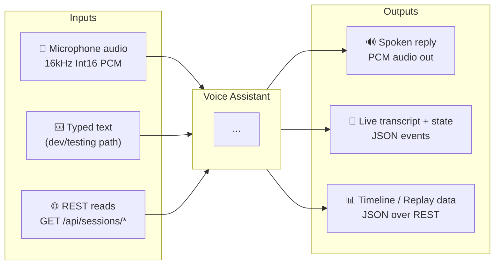
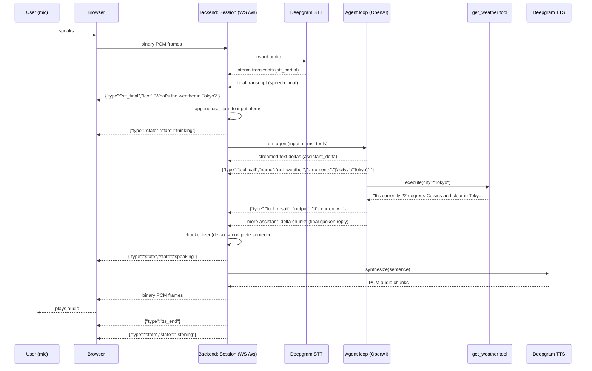
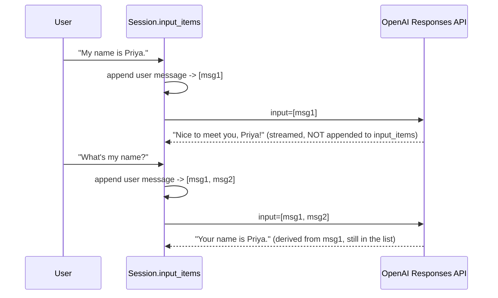
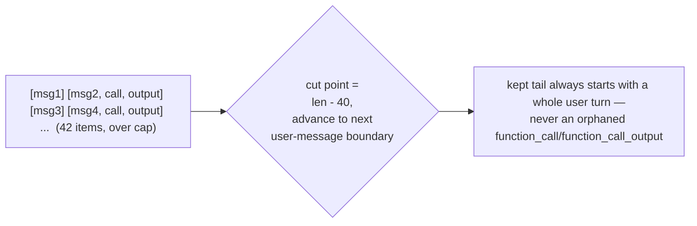
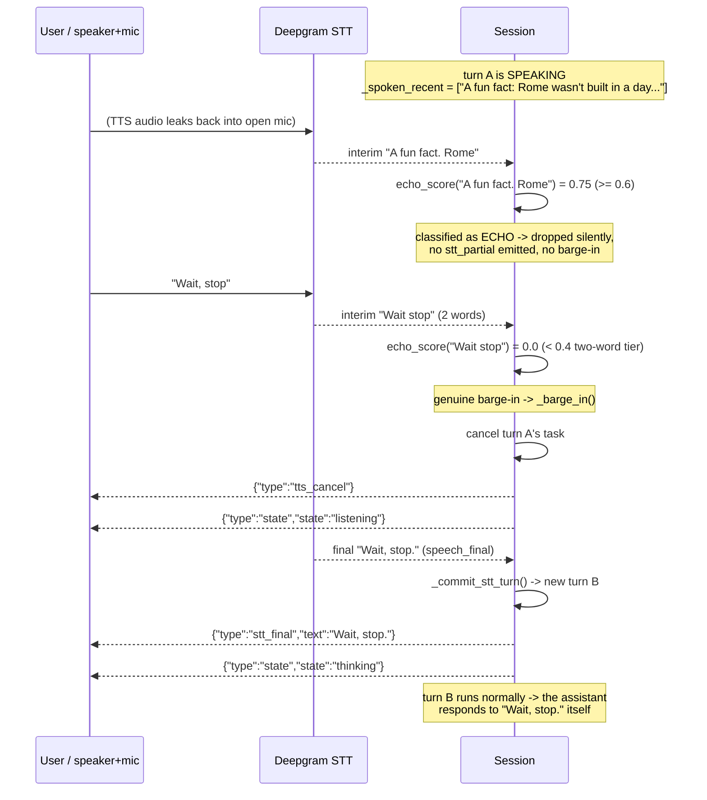
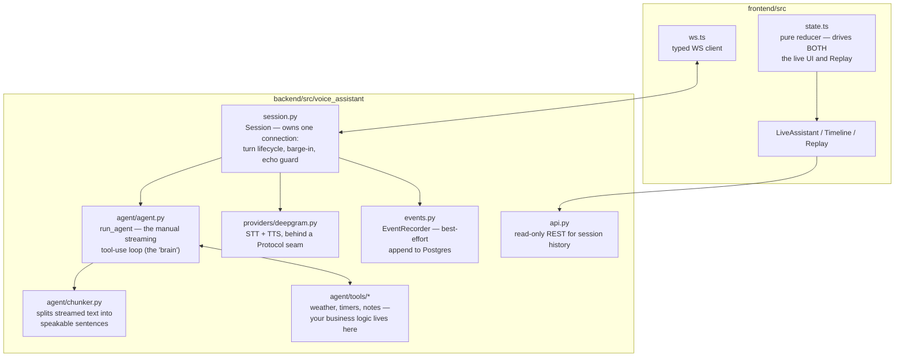
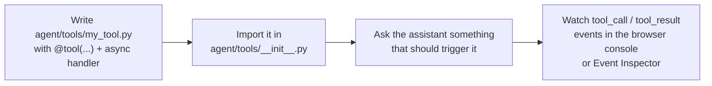
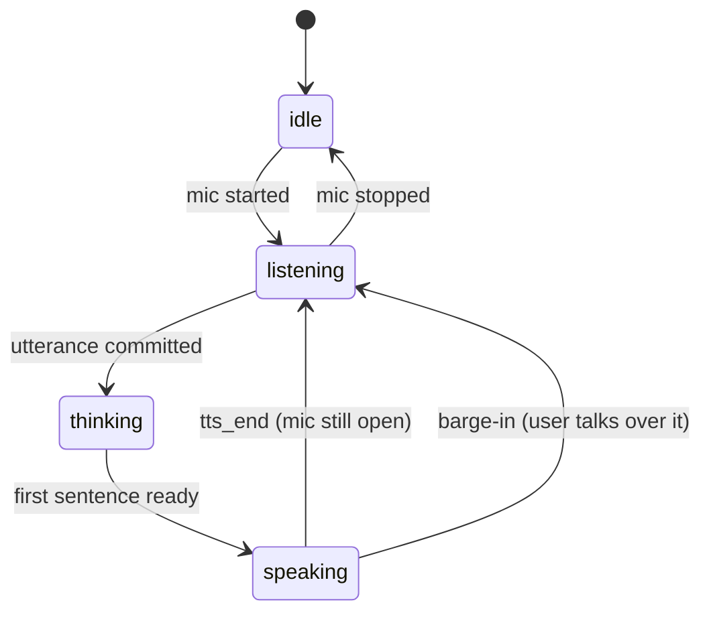
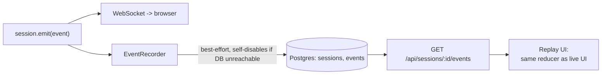
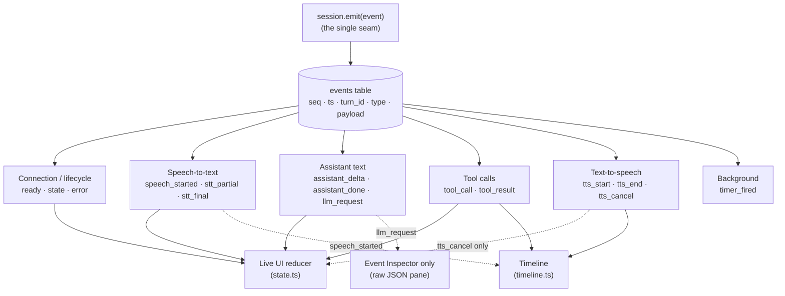

# New Hire Guide — Voice Assistant

Welcome! This doc gets you from zero to productive: what the system does,
what goes in and out of it, how a request flows through the code, and where
to make your first change. It intentionally skips detail that's better read
straight from the code — file references point you there.

For the canonical architecture diagram and design-decision rationale, see
the [README](../README.md). For known rough edges, see
[TECH_DEBT.md](../TECH_DEBT.md).

---

## 1. What this thing does, in one sentence

You talk to it in a browser tab; it turns your speech into text, thinks
(optionally calling tools like a weather lookup), and speaks its answer
back — over one WebSocket, sentence by sentence, in under ~2 seconds.

---

## 2. Inputs and outputs first

Before touching any business logic, know the system's edges: what comes in,
what goes out, and on which channel. Everything else in this codebase exists
to turn the left column into the right column.

### The system's black box



### Every channel, concretely

| Channel | Direction | Transport | Carries |
|---|---|---|---|
| Mic audio | in | `WS /ws` binary frames | raw Int16 PCM, 16kHz mono, no header |
| Typed message | in | `WS /ws` JSON `{"type":"text_input","text":...}` | one user turn (used by [ws_client.py](../scripts/ws_client.py) and tests; the UI mic path is the real one) |
| Start/stop mic | in | `WS /ws` JSON `{"type":"start"\|"stop"}` | opens/closes the STT capture |
| TTS audio | out | `WS /ws` binary frames | raw Int16 PCM, 24kHz mono, no header |
| Everything else (transcript, state, tool calls, errors) | out | `WS /ws` JSON, one `type`-tagged event per line | see [protocol.py](../backend/src/voice_assistant/protocol.py) |
| Session history | out | `GET /api/sessions`, `GET /api/sessions/:id/events` | past conversations, for Timeline/Replay |

The full input/output contract is one file:
[`protocol.py`](../backend/src/voice_assistant/protocol.py) (backend) mirrored by
[`ws.ts`](../frontend/src/ws.ts) (frontend). If you're ever unsure what a
message looks like, that's the source of truth — not this doc.

**Rule of thumb:** JSON text frames are *control* (what state are we in, what
did you say, what tool ran). Binary frames are *audio*. Nothing else crosses
the wire.

---

## 3. One request, start to finish

Concrete example: the user says **"What's the weather in Tokyo?"**



Every arrow labeled `WS-->>B` above is one JSON line sent through the
**single `emit()` seam** in
[`session.py`](../backend/src/voice_assistant/session.py) — the same call
also persists the event to Postgres for replay. That one seam is the most
important architectural fact in this codebase: *everything the UI ever
learns, and everything ever replayed, flows through it.*

---

## 4. Multi-turn conversations: how history accumulates

There's no separate "conversation memory" component. Multi-turn context is
just `input_items` — the list `Session` owns — growing as turns happen and
being re-sent, in full, on every single call to OpenAI.

The rule (see [`history.py`](../backend/src/voice_assistant/agent/history.py)):
each turn appends one `user` message, then zero or more `function_call` /
`function_call_output` pairs if the model used a tool. **The assistant's own
spoken reply text is never appended back into `input_items`** — only the user
side and any tool exchanges are. The model doesn't need its own past replies
restated; it re-derives them fresh from the accumulated user turns each time.

### Concrete example: two turns, real payloads

**Turn 1** — user: *"My name is Priya."* No tool needed, so nothing but the
user message is added:

```json
// session.input_items after turn 1
[
  {"type": "message", "role": "user", "content": [{"type": "input_text", "text": "My name is Priya."}]}
]
```

The model replies "Nice to meet you, Priya!" — that reply is streamed to the
browser as `assistant_delta`/`assistant_done` and spoken via TTS, but it is
**not** written back into `input_items`.

**Turn 2** — user: *"What's my name?"* `_run_turn` appends the new user
message onto the *same* list before calling `run_agent` again:

```json
// session.input_items after turn 2 (sent verbatim as `input` to OpenAI)
[
  {"type": "message", "role": "user", "content": [{"type": "input_text", "text": "My name is Priya."}]},
  {"type": "message", "role": "user", "content": [{"type": "input_text", "text": "What's my name?"}]}
]
```

The model answers "Your name is Priya" correctly — not because it "remembers"
its own turn-1 reply, but because turn 1's *user* message is still sitting in
the list it's handed every time. This is also exactly what an `llm_request`
replay event captures verbatim (Section 9) — it's the literal `input` array
for that iteration, so you can always see precisely what the model saw.



### When a turn uses a tool

Tool turns add more items than a plain reply. Continuing the example, a
third turn — *"What's the weather where I am, Tokyo?"* — appends a user
message **and** the `function_call`/`function_call_output` pair from
Section 3's example:

```json
[
  {"type": "message", "role": "user", "content": [{"type": "input_text", "text": "My name is Priya."}]},
  {"type": "message", "role": "user", "content": [{"type": "input_text", "text": "What's my name?"}]},
  {"type": "message", "role": "user", "content": [{"type": "input_text", "text": "What's the weather where I am, Tokyo?"}]},
  {"type": "function_call", "call_id": "call_1", "name": "get_weather", "arguments": "{\"city\":\"Tokyo\"}"},
  {"type": "function_call_output", "call_id": "call_1", "output": "It's currently 22 degrees Celsius and clear in Tokyo."}
]
```

### Why it can't grow forever

`session.py` caps `input_items` at `MAX_INPUT_ITEMS = 40`. When a turn would
push the list over that, `truncate_history()` drops the oldest items — but
only up to the next `user`-message boundary, never mid-turn, so a
`function_call` is never separated from its `function_call_output` (the API
rejects that combination with a 400):



The system prompt is **never** part of this list — it rides in
`instructions=` on every call, which is also why it must stay static
(prompt-caching, per [CLAUDE.md](../CLAUDE.md)) regardless of how much
`input_items` churns.

---

## 5. Barge-in: when the user talks over the assistant

The mic stays open the entire time the assistant is speaking — there's no
push-to-talk. That means every word of TTS audio played through the
speaker can leak back into the mic and come back as a transcript. `session.py`
has to tell apart two things that look identical to Deepgram:

- **Echo** — the assistant hearing itself. Must be dropped silently.
- **Genuine barge-in** — the user actually interrupting. Must cancel the
  in-flight turn immediately.

It does this by scoring each interim transcript against
`_spoken_recent` (the last 20 sentences the assistant actually said) via
`_echo_score()`, then applying three tiers in `_consume_stt()`:

| Interim transcript | Rule | Threshold |
|---|---|---|
| Any length | echo score ≥ `_ECHO_THRESHOLD` | `0.6` → dropped as echo, never barges |
| ≥ 3 words | not classified as echo | always barges (`_MIN_BARGE_IN_WORDS = 3`) |
| exactly 2 words | echo score < `_TWO_WORD_BARGE_MAX_SCORE` | `0.4` → barges; otherwise dropped |
| 1 word | — | never barges (too little signal either way) |

(The 2-word tier and its `0.4` cutoff exist because live testing showed
Deepgram can jump straight from a 2-word interim to a final — see
[`docs/bug-self-barge-in-echo.md`](bug-self-barge-in-echo.md) for the
incident that produced these exact numbers.)

### Concrete example: an echo that's correctly ignored, then a real interrupt

The assistant is mid-reply to *"Tell me a fun fact about Rome."*, speaking
*"A fun fact: Rome wasn't built in a day..."* Two things happen while it
talks:



Two important details this reveals:

1. **The interrupting utterance becomes the next real turn.** Barge-in
  doesn't discard what the user said — it cancels the *old* reply, and the
  new utterance ("Wait, stop.") is committed and sent to the model like any
  other turn, exactly as in Section 3.
2. **`turn A` never gets a `tts_end` or `assistant_done` at its true content
  boundary.** It ends mid-sentence with `tts_cancel` instead. That's the
  signal Timeline/Replay use to render it as a cancelled bar (see
  `computeTurns()`'s `cancelled` flag in
  [`timeline.ts`](../frontend/src/timeline.ts)) and why the frontend reducer
  has a dedicated `tts_cancel` case (`state.ts`) to close the partial
  assistant bubble without waiting for a done event that will never arrive.

### What actually gets recorded for the cancelled turn

Turn A's slice of the `events` table (abbreviated, same shape as Section 9):

```json
[
  {"seq": 60, "type": "stt_final", "turn_id": "turnA", "payload": {"text": "Tell me a fun fact about Rome."}},
  {"seq": 61, "type": "state", "turn_id": "turnA", "payload": {"state": "thinking"}},
  {"seq": 62, "type": "assistant_delta", "turn_id": "turnA", "payload": {"text": "A fun fact: "}},
  {"seq": 63, "type": "state", "turn_id": "turnA", "payload": {"state": "speaking"}},
  {"seq": 64, "type": "tts_start", "turn_id": "turnA", "payload": {"sentence_index": 0, "text": "A fun fact: Rome wasn't built in a day..."}},
  {"seq": 65, "type": "tts_cancel", "turn_id": "turnA", "payload": {}},
  {"seq": 66, "type": "state", "turn_id": "turnA", "payload": {"state": "listening"}}
]
```

Notice what's **absent**: no `assistant_done`, no `tts_end`. `timeline.ts`'s
`computeTurns()` treats either `tts_end` *or* `tts_cancel` as the turn's end
marker, and sets `cancelled: true` whenever a `tts_cancel` is present in the
group — that single boolean is the only thing that distinguishes "the
assistant finished" from "the user cut it off" when you look at the log
later.

---

## 6. The pieces, and what each one owns



If you're adding a **new capability the assistant can do** (e.g. "look up a
stock price"), you're almost certainly working in `agent/tools/`. If you're
changing **how a turn behaves** (barge-in, echo detection, when TTS starts),
you're in `session.py`. If you're changing **what the model sees or how
tool-calling works**, you're in `agent/agent.py`.

---

## 7. Business logic: how a tool works (the extension point)

Tools are the main way this app's behavior grows, so it's worth seeing one
end to end. Here's the real `get_weather` tool
([`weather.py`](../backend/src/voice_assistant/agent/tools/weather.py)),
trimmed:

```python
@tool(
    name="get_weather",
    description="Get the current weather for a city by name.",
    parameters={
        "type": "object",
        "properties": {"city": {"type": "string", "description": "City name, e.g. 'Tokyo'."}},
        "required": ["city"],
        "additionalProperties": False,
    },
)
async def get_weather(ctx, *, city: str) -> str:
    # ... geocode city, fetch current conditions ...
    return f"It's currently {temp} degrees Celsius and {desc} in {place['name']}."
```

**What makes a tool a tool:**

1. The `@tool(...)` decorator registers it — name, description, and a
   JSON-schema `parameters` block. This is exactly what gets handed to
   OpenAI so the model knows the tool exists and how to call it.
2. The handler is `async def handler(ctx: ToolContext, **kwargs) -> str`.
   `ctx.session` gives you the live `Session` if you need to reach back into
   it (e.g. `timers.py`'s `set_timer` calls `ctx.session.schedule_timer(...)`).
3. **Return a plain string.** Whatever you return is read back to the model
   as the tool's output — write it the way you'd want it *spoken*, not as
   structured data.
4. You don't need to catch your own exceptions. If your handler raises,
   `agent/agent.py` turns it into `"Error: <message>"` and the model gets to
   react conversationally instead of the WebSocket dying.

That's the whole contract — no registration step elsewhere, no manual
wiring. Import the module once from
[`agent/tools/__init__.py`](../backend/src/voice_assistant/agent/tools/__init__.py)
and the `@tool` decorator does the rest via
[`registry.py`](../backend/src/voice_assistant/agent/tools/registry.py).

### Try it yourself: adding a tool



---

## 8. Where conversation state actually lives

Two easy-to-confuse things share the name "state":

- **`input_items`** (`session.py`) — the literal list of messages/tool calls
  sent to OpenAI on every turn. The app owns this list itself
  (`store=False` on the API call), which is *why* replay is possible at all:
  the exact request the model saw is serializable and gets emitted as an
  `llm_request` event.
- **The pipeline state machine** — `idle → listening → thinking → speaking →
  listening`, broadcast as `{"type":"state","state":...}` events, and folded
  by the frontend reducer in [`state.ts`](../frontend/src/state.ts).



Persistence follows the same events, one row per event, append-only:



---

## 9. Every event type stored for Replay

There is no allowlist or filtering step. `Session.emit()` in
[`session.py`](../backend/src/voice_assistant/session.py) is the *only* place
a server→client event is ever sent, and it unconditionally hands every event
to `EventRecorder.record()`
([`events.py`](../backend/src/voice_assistant/events.py)) right after writing
it to the WebSocket:

```python
async def emit(self, event) -> None:
    await self.ws.send_json(event.model_dump())
    ...
    self._recorder.record(event, turn_id=self._current_turn_id, trace_id=trace_id, span_id=span_id)
```

So the rule is simple: **every one of the 15 event types defined in
[`protocol.py`](../backend/src/voice_assistant/protocol.py) is recorded, with
no exceptions.** What differs between them is which *consumer* reads them
back — the live UI reducer, the Timeline, or only the raw Event Inspector.



### The full list

| `type` | Category | Payload fields | Recorded? | Read back by |
|---|---|---|---|---|
| `ready` | connection | `session_id` | ✅ | Live UI (sets session id) |
| `state` | connection | `state` (`idle`\|`listening`\|`thinking`\|`speaking`) | ✅ | Live UI + Timeline (phase boundaries) |
| `speech_started` | STT | *(none)* | ✅ | Timeline only — marks listening-phase onset; live reducer ignores it |
| `stt_partial` | STT | `text` | ✅ | Live UI (interim caption) |
| `stt_final` | STT | `text` | ✅ | Live UI (commits user bubble) + Timeline (listening→thinking boundary) |
| `assistant_delta` | assistant text | `text` | ✅ | Live UI (streams assistant bubble) |
| `assistant_done` | assistant text | `text` (full reply) | ✅ | Live UI (finalizes assistant bubble) |
| `llm_request` | assistant text | `input` (full serialized request), `model`, `iteration` | ✅ | Event Inspector only — live reducer ignores it |
| `tool_call` | tool | `call_id`, `name`, `arguments` | ✅ | Live UI (tool activity "running") + Timeline (tool sub-span start) |
| `tool_result` | tool | `call_id`, `name`, `output` | ✅ | Live UI (tool activity "done") + Timeline (tool sub-span end) |
| `tts_start` | TTS | `sentence_index`, `text` | ✅ | Timeline (thinking→speaking boundary) |
| `tts_end` | TTS | *(none)* | ✅ | Timeline (speaking-phase end) |
| `tts_cancel` | TTS | *(none)* | ✅ | Live UI (closes interrupted bubble) + Timeline (marks turn cancelled) |
| `timer_fired` | background | `timer_id`, `label` | ✅ | Live UI (notification banner) |
| `error` | error | `message` | ✅ | Live UI (error banner) |

Binary audio frames (mic PCM in, TTS PCM out) are **not** in this list —
audio itself is never persisted, only the fact that a `tts_start`/`tts_end`
happened. Replay reconstructs timing and transcript, not the actual sound.

### Concrete example: what gets stored for one turn

Continuing the "What's the weather in Tokyo?" example from Section 3, this
is roughly what lands in the `events` table (same `turn_id`, ascending
`seq`, abbreviated):

```json
[
  {"seq": 41, "type": "speech_started", "turn_id": "8f2a...", "payload": {"type": "speech_started"}},
  {"seq": 42, "type": "stt_final", "turn_id": "8f2a...", "payload": {"type": "stt_final", "text": "What's the weather in Tokyo?"}},
  {"seq": 43, "type": "state", "turn_id": "8f2a...", "payload": {"type": "state", "state": "thinking"}},
  {"seq": 44, "type": "llm_request", "turn_id": "8f2a...", "payload": {"type": "llm_request", "iteration": 0, "model": "gpt-5-mini", "input": [ /* full input_items list */ ]}},
  {"seq": 45, "type": "tool_call", "turn_id": "8f2a...", "payload": {"type": "tool_call", "call_id": "call_1", "name": "get_weather", "arguments": "{\"city\":\"Tokyo\"}"}},
  {"seq": 46, "type": "tool_result", "turn_id": "8f2a...", "payload": {"type": "tool_result", "call_id": "call_1", "name": "get_weather", "output": "It's currently 22 degrees Celsius and clear in Tokyo."}},
  {"seq": 47, "type": "assistant_delta", "turn_id": "8f2a...", "payload": {"type": "assistant_delta", "text": "It's "}},
  {"seq": 48, "type": "assistant_delta", "turn_id": "8f2a...", "payload": {"type": "assistant_delta", "text": "currently 22°C and clear in Tokyo."}},
  {"seq": 49, "type": "state", "turn_id": "8f2a...", "payload": {"type": "state", "state": "speaking"}},
  {"seq": 50, "type": "tts_start", "turn_id": "8f2a...", "payload": {"type": "tts_start", "sentence_index": 0, "text": "It's currently 22°C and clear in Tokyo."}},
  {"seq": 51, "type": "assistant_done", "turn_id": "8f2a...", "payload": {"type": "assistant_done", "text": "It's currently 22°C and clear in Tokyo."}},
  {"seq": 52, "type": "tts_end", "turn_id": "8f2a...", "payload": {"type": "tts_end"}},
  {"seq": 53, "type": "state", "turn_id": "8f2a...", "payload": {"type": "state", "state": "listening"}}
]
```

`GET /api/sessions/8f2a.../events` returns exactly this shape (see
`EventOut` in [`api.py`](../backend/src/voice_assistant/api.py)). Replay
folds each `payload` through the *same* `reducer()` in `state.ts` that
drives the live page — feed it these 13 events in order and you get back
the identical UI state the user saw live, plus `timeline.ts` uses the
`speech_started` / `tts_start` / `tts_end` / `tool_call` / `tool_result`
subset to draw the per-turn Gantt bars.

---

## 10. Common first tasks

| Task | Start here |
|---|---|
| Run it locally | `./start.sh` from repo root (see [README Quickstart](../README.md#quickstart)) |
| Add a tool | `backend/src/voice_assistant/agent/tools/` — copy `weather.py`'s shape |
| Change what the assistant is told to be | `agent/prompts.py` — **keep it static**, no timestamps/IDs (breaks prompt caching, see CLAUDE.md) |
| Change turn/barge-in behavior | `session.py` — read the module docstring and the echo-guard comments first, they encode real incident learnings |
| Add a new WS event type | Add it to `protocol.py` **and** mirror it in `ws.ts` — they must never drift |
| See a conversation replayed | Have a chat on `/`, then open `/sessions` → pick it → Timeline/Replay/Event Inspector |
| See distributed traces | `make up` starts Jaeger; set `OTEL_EXPORTER_OTLP_ENDPOINT` in `.env`, see it at `localhost:16686` |
| Run the tests | `make test` (backend pytest, all externals mocked — no API keys needed) |

---

## 11. A few things that look like bugs but aren't

- **The mic stays open while the assistant is speaking.** This is
  intentional (barge-in support) — `session.py` runs an echo-detection
  heuristic to tell "user interrupting" from "assistant's own voice leaking
  back through the speaker into the mic." See the constants and comments
  around `_ECHO_THRESHOLD` in `session.py` before touching this — the
  thresholds came from tuning against real misheard-echo transcripts.
- **The chunker is plain sync code, not `async`.** It's CPU-bound string
  splitting called inline from the one async task that owns it — there's no
  thread-safety problem to solve here, so resist the urge to add one.
- **Tool calls run in the same OpenAI response stream as the text**, not as
  a separate request/response round trip. That's why the agent loop is
  hand-written instead of using the OpenAI SDK's tool-runner: streaming text
  and executing tools mid-stream doesn't fit that abstraction.

---

## 12. Where to go next

- [README.md](../README.md) — full architecture diagram, latency budget,
  design-decision rationale.
- [TECH_DEBT.md](../TECH_DEBT.md) — known gaps, so you don't "discover" and
  re-report something already tracked.
- [docs/bug-self-barge-in-echo.md](bug-self-barge-in-echo.md) — a real
  incident write-up behind the echo-guard code in `session.py`.
- [CLAUDE.md](../CLAUDE.md) — the non-negotiable conventions (API shapes,
  model config, why certain things are sync vs async) — read before making
  an architectural change, not after.
