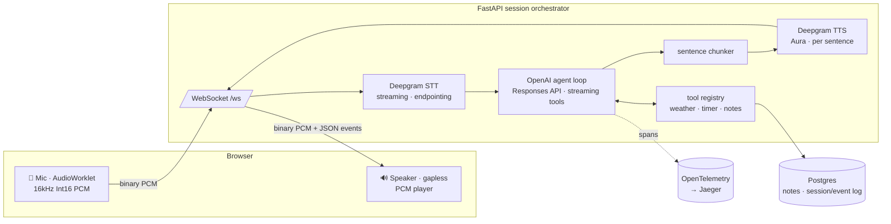

# Phase 5 — Polish Implementation Plan

> **For agentic workers:** REQUIRED SUB-SKILL: Use superpowers:subagent-driven-development (recommended) or superpowers:executing-plans to implement this plan task-by-task. Steps use checkbox (`- [ ]`) syntax for tracking.

**Goal:** Harden the working Phase 0–4 voice assistant for a portfolio audience — history truncation, STT reconnect, complete docs, a filled-out test suite, and a verified container image.

**Architecture:** Five loosely-coupled slices, each an independent commit, backend/ruff + frontend/tsc green at each. New reliability code lives behind existing seams (a pure history helper; reconnect inside the Deepgram provider surfaced via one new normalized `SttClosed` event). No new product surface.

**Tech Stack:** Python 3.12 / FastAPI / SQLAlchemy async / Alembic / pytest+respx; React+Vite+TypeScript / vitest; Docker Compose; OpenTelemetry+Jaeger.

## Global Constraints

- Conventional commits, one focused commit per task. End commit messages with `Co-Authored-By: Claude Opus 4.8 <noreply@anthropic.com>`.
- Backend tests run from `backend/` via `uv run pytest`; keep every test hermetic (no API keys) except DB tests, which `pytest.skip` when Postgres is unreachable (mirror `test_tools.py`).
- Vendor SDK types never leak past `providers/`. Session code sees only normalized dataclasses from `providers/base.py`.
- `MAX_INPUT_ITEMS = 40` (history cap). `_MAX_RECONNECT_ATTEMPTS = 3` with backoff `[0.5, 1.0, 2.0]` seconds.
- OpenAI system prompt stays in `instructions=`, never in `input_items` — do not add it to the truncation input.
- Screenshot + demo GIF are OUT of scope (Phase 6). Do not add image slots to the README.
- `input_items` item shapes: user = `{"type":"message","role":"user","content":[{"type":"input_text","text":...}]}`; tool call = `{"type":"function_call","call_id","name","arguments"}`; tool output = `{"type":"function_call_output","call_id","output"}`. Assistant text replies are NOT stored in `input_items` (existing behavior — leave it).

---

### Task 1: History truncation guard

**Files:**
- Create: `backend/src/voice_assistant/agent/history.py`
- Create: `backend/tests/test_history.py`
- Modify: `backend/src/voice_assistant/session.py` (add `MAX_INPUT_ITEMS` constant near line 61; call `truncate_history` at the top of `_run_turn`, line ~208, before appending the new user message)

**Interfaces:**
- Produces: `truncate_history(items: list[dict], max_items: int) -> list[dict]` — pure, returns a new list (or the same object when under cap), never orphans a `function_call`/`function_call_output` pair, never splits a turn.

- [ ] **Step 1: Write the failing tests**

Create `backend/tests/test_history.py`:

```python
"""Pure-function tests for conversation history truncation (Phase 5)."""

from voice_assistant.agent.history import truncate_history


def _user(text: str) -> dict:
    return {"type": "message", "role": "user", "content": [{"type": "input_text", "text": text}]}


def _call(call_id: str) -> dict:
    return {"type": "function_call", "call_id": call_id, "name": "get_weather", "arguments": "{}"}


def _output(call_id: str) -> dict:
    return {"type": "function_call_output", "call_id": call_id, "output": "ok"}


def test_under_cap_returns_unchanged() -> None:
    items = [_user("a"), _user("b")]
    assert truncate_history(items, max_items=40) == items


def test_over_cap_drops_whole_oldest_turns() -> None:
    # 5 plain user turns; cap 3 -> keep the newest 3, drop the oldest 2.
    items = [_user(str(i)) for i in range(5)]
    result = truncate_history(items, max_items=3)
    assert result == [_user("2"), _user("3"), _user("4")]


def test_never_orphans_a_tool_pair() -> None:
    # Turn layout: user, call, output  (3 items) x 3 turns = 9 items.
    items: list[dict] = []
    for i in range(3):
        items += [_user(str(i)), _call(f"c{i}"), _output(f"c{i}")]
    # Cap 4 would tentatively cut at index 5 (mid-turn 1, between call & output).
    result = truncate_history(items, max_items=4)
    # Must advance to the next user boundary (index 6) -> keep whole turn 2.
    assert result == [_user("2"), _call("c2"), _output("c2")]
    # No orphan: every function_call_output has its function_call present.
    call_ids = {i["call_id"] for i in result if i["type"] == "function_call"}
    for it in result:
        if it["type"] == "function_call_output":
            assert it["call_id"] in call_ids


def test_single_giant_turn_keeps_whole_tail() -> None:
    # One user message followed by 50 call/output items, cap 10: no user
    # boundary at/after the tentative cut -> keep the whole tail intact.
    items: list[dict] = [_user("start")]
    for i in range(25):
        items += [_call(f"c{i}"), _output(f"c{i}")]
    result = truncate_history(items, max_items=10)
    assert result == items  # never orphan; keep everything
```

- [ ] **Step 2: Run the tests to verify they fail**

Run: `cd backend && uv run pytest tests/test_history.py -v`
Expected: FAIL — `ModuleNotFoundError: No module named 'voice_assistant.agent.history'`

- [ ] **Step 3: Write the implementation**

Create `backend/src/voice_assistant/agent/history.py`:

```python
"""Conversation-history truncation.

The OpenAI conversation state is client-owned (``store=False``), so ``Session``
keeps the running ``input_items`` list itself and re-sends it every turn. Left
unbounded it grows without limit. This trims the oldest *whole turns* once the
list exceeds a cap.

Turns are laid out ``user message -> [function_call..., function_call_output...]``.
A ``user`` message is therefore always a safe cut boundary: cutting there keeps
whole turns and never orphans a ``function_call``/``function_call_output`` pair
(which the Responses API rejects with a 400). The system prompt rides in
``instructions=`` and is never part of ``input_items``, so it is untouched.
"""


def _is_user_message(item: dict) -> bool:
    return item.get("type") == "message" and item.get("role") == "user"


def truncate_history(items: list[dict], max_items: int) -> list[dict]:
    """Return ``items`` trimmed to at most ~``max_items``, dropping only whole
    oldest turns. Returns the same list object when already under the cap.

    The trim point is advanced forward from ``len - max_items`` to the next
    ``user`` message boundary, so the kept tail always starts a clean turn. If
    no user boundary exists at/after that point (one enormous tool-calling
    turn), the whole tail is kept rather than orphan a call/output pair.
    """
    if len(items) <= max_items:
        return items

    tentative = len(items) - max_items
    cut = next(
        (i for i in range(tentative, len(items)) if _is_user_message(items[i])),
        None,
    )
    if cut is None:
        return items
    return items[cut:]
```

- [ ] **Step 4: Run the tests to verify they pass**

Run: `cd backend && uv run pytest tests/test_history.py -v`
Expected: PASS (4 passed)

- [ ] **Step 5: Wire it into Session**

In `backend/src/voice_assistant/session.py`, add the import near the other agent imports (line ~22):

```python
from voice_assistant.agent.history import truncate_history
```

Add the constant next to `_TURN_END` (line ~61):

```python
# Cap on client-owned conversation history re-sent to OpenAI each turn. Oldest
# whole turns past this are trimmed (agent/history.py); the system prompt rides
# in instructions= and is never part of this list, so it's never dropped.
MAX_INPUT_ITEMS = 40
```

In `_run_turn`, inside the `turn` span, immediately before the `self.input_items.append({...user...})` call (line ~210), add:

```python
                self.input_items = truncate_history(self.input_items, MAX_INPUT_ITEMS)
```

- [ ] **Step 6: Run the full backend suite + lint**

Run: `cd backend && uv run pytest -q && uv run ruff check .`
Expected: PASS (prior count + 4 new), ruff clean.

- [ ] **Step 7: Commit**

```bash
git add backend/src/voice_assistant/agent/history.py backend/tests/test_history.py backend/src/voice_assistant/session.py
git commit -m "feat(agent): truncate oldest whole turns past 40-item history cap

Co-Authored-By: Claude Opus 4.8 <noreply@anthropic.com>"
```

---

### Task 2: Deepgram STT reconnect

**Files:**
- Modify: `backend/src/voice_assistant/providers/base.py` (add `SttClosed` dataclass; add it to the `SttEvent` union)
- Modify: `backend/src/voice_assistant/providers/deepgram.py` (extract `_open_socket`/`_close_socket`; add `_closing` flag + reconnect loop; import `SttClosed`)
- Modify: `backend/src/voice_assistant/session.py` (`_consume_stt` gains an `SttClosed` branch; import `SttClosed`)
- Create: `backend/tests/test_stt_reconnect.py`
- Modify: `backend/tests/test_session_stt.py` (add one session-level `SttClosed` test — or put it in the new file; keep it wherever the FakeSTTProvider lives — put the session test in `test_stt_reconnect.py` and import the fake)

**Interfaces:**
- Produces: `SttClosed` normalized event (empty dataclass) in `providers/base.py`, added to `SttEvent`.
- Produces: `DeepgramSTT` now transparently reconnects up to `_MAX_RECONNECT_ATTEMPTS` times on an unexpected socket end; enqueues one `SttClosed` when exhausted; `finish()`/`aclose()` set `_closing` so an intentional stop never reconnects.
- Consumes (session): on `SttClosed`, emit `ErrorEvent` + `StateEvent(state="idle")`, detach the provider, return from `_consume_stt`.

- [ ] **Step 1: Write the failing provider tests**

Create `backend/tests/test_stt_reconnect.py`:

```python
"""Reconnect behavior for DeepgramSTT (Phase 5) + the session-level handling
of a terminal SttClosed event. No real Deepgram SDK or key is involved — the
socket + connect step are faked via monkeypatching the provider's open seam.
"""

import asyncio
import os

os.environ.setdefault("OPENAI_API_KEY", "test-key")

import pytest

from voice_assistant.providers.base import SttClosed, Transcript
from voice_assistant.providers.deepgram import DeepgramSTT


class _FakeSocket:
    """Async-iterable that yields N Results messages then ends (simulating a
    dropped/closed Deepgram socket)."""

    def __init__(self, transcripts: list[str]) -> None:
        self._transcripts = transcripts

    def __aiter__(self):
        return self._gen()

    async def _gen(self):
        for t in self._transcripts:
            yield _results_msg(t)


def _results_msg(text: str):
    from types import SimpleNamespace

    alt = SimpleNamespace(transcript=text)
    channel = SimpleNamespace(alternatives=[alt])
    return SimpleNamespace(
        type="Results", channel=channel, is_final=True, speech_final=False
    )


async def _drain(stt: DeepgramSTT, n: int) -> list:
    out = []
    gen = stt.events()
    for _ in range(n):
        out.append(await asyncio.wait_for(gen.__anext__(), timeout=1.0))
    return out


async def test_reconnects_on_unexpected_socket_end() -> None:
    # Each opened socket yields one transcript then ends; the reader should
    # reopen and keep producing until we've seen transcripts from 2 sockets.
    sockets = [_FakeSocket(["first"]), _FakeSocket(["second"]), _FakeSocket(["third"])]
    opened = {"n": 0}

    stt = DeepgramSTT(api_key="x")

    async def fake_open() -> None:
        stt._socket = sockets[opened["n"]]  # noqa: SLF001 - test seam
        opened["n"] += 1

    async def fake_close() -> None:
        pass

    stt._open_socket = fake_open  # noqa: SLF001
    stt._close_socket = fake_close  # noqa: SLF001
    # No backoff delay in tests.
    stt._reconnect_delays = [0.0, 0.0, 0.0]  # noqa: SLF001

    await stt.start()
    events = await _drain(stt, 2)
    assert [e.text for e in events if isinstance(e, Transcript)] == ["first", "second"]
    assert opened["n"] >= 2
    await stt.aclose()


async def test_emits_sttclosed_when_reconnect_exhausted() -> None:
    stt = DeepgramSTT(api_key="x")
    opened = {"n": 0}

    async def fake_open() -> None:
        # First open succeeds with an immediately-ending socket; every reopen
        # raises to simulate the endpoint being unreachable.
        if opened["n"] == 0:
            stt._socket = _FakeSocket([])  # noqa: SLF001 - ends immediately
            opened["n"] += 1
            return
        raise RuntimeError("connection refused")

    async def fake_close() -> None:
        pass

    stt._open_socket = fake_open  # noqa: SLF001
    stt._close_socket = fake_close  # noqa: SLF001
    stt._reconnect_delays = [0.0, 0.0, 0.0]  # noqa: SLF001

    await stt.start()
    gen = stt.events()
    ev = await asyncio.wait_for(gen.__anext__(), timeout=1.0)
    assert isinstance(ev, SttClosed)
    await stt.aclose()


async def test_finish_prevents_reconnect() -> None:
    stt = DeepgramSTT(api_key="x")
    opened = {"n": 0}

    async def fake_open() -> None:
        stt._socket = _FakeSocket(["only"])  # noqa: SLF001
        opened["n"] += 1

    async def fake_close() -> None:
        pass

    stt._open_socket = fake_open  # noqa: SLF001
    stt._close_socket = fake_close  # noqa: SLF001

    await stt.start()
    # Mark intentional stop before the socket's single message drains out.
    await stt.finish()
    await asyncio.sleep(0.05)
    # Only the initial open happened; no reconnect after the socket ended.
    assert opened["n"] == 1
    await stt.aclose()
```

Note the tests reference `DeepgramSTT(api_key=...)` — the existing `__init__` already accepts `api_key`. Add `pytestmark = pytest.mark.asyncio` if the project isn't in `asyncio_mode = auto`; check `backend/pyproject.toml` `[tool.pytest.ini_options]` — if `asyncio_mode = "auto"` is set, no marker is needed (the existing async tests have none, so it is auto).

- [ ] **Step 2: Run to verify they fail**

Run: `cd backend && uv run pytest tests/test_stt_reconnect.py -v`
Expected: FAIL — `ImportError: cannot import name 'SttClosed'`

- [ ] **Step 3: Add the `SttClosed` event**

In `backend/src/voice_assistant/providers/base.py`, after the `UtteranceEnd` dataclass (line ~48) add:

```python
@dataclass
class SttClosed:
    """Terminal normalized event: the STT connection dropped and bounded
    auto-reconnect was exhausted. ``Session`` surfaces this as an error and
    settles the pipeline back to idle; the user restarts the mic to retry.
    """
```

Update the union (line ~51):

```python
SttEvent = Transcript | SpeechStarted | UtteranceEnd | SttClosed
```

- [ ] **Step 4: Implement reconnect in DeepgramSTT**

In `backend/src/voice_assistant/providers/deepgram.py`:

Add to the imports of normalized events (find the existing `from .base import ...` / `from voice_assistant.providers.base import ...`) `SttClosed`.

Add module constants near the other `_ENCODING`/`_SAMPLE_RATE` constants:

```python
_MAX_RECONNECT_ATTEMPTS = 3
_RECONNECT_DELAYS = [0.5, 1.0, 2.0]  # seconds, indexed by (attempt - 1)
```

In `__init__`, add:

```python
        self._closing = False
        self._reconnect_delays = _RECONNECT_DELAYS
```

Replace `start()` so the socket-open logic is extracted:

```python
    async def start(self) -> None:
        """Open the Deepgram streaming socket and start the background reader
        task that translates raw SDK messages into normalized events and
        transparently reconnects on an unexpected drop."""
        self._closing = False
        await self._open_socket()
        self._reader_task = asyncio.create_task(self._read_loop())

    async def _open_socket(self) -> None:
        self._client = AsyncDeepgramClient(api_key=self._api_key)
        self._connect_cm = self._client.listen.v1.connect(
            model=self._model,
            encoding=_ENCODING,
            sample_rate=_SAMPLE_RATE,
            channels=_CHANNELS,
            language="en",
            interim_results=True,
            endpointing=_ENDPOINTING_MS,
            utterance_end_ms=_UTTERANCE_END_MS,
            vad_events=True,
            punctuate=True,
        )
        self._socket = await self._connect_cm.__aenter__()

    async def _close_socket(self) -> None:
        cm = self._connect_cm
        self._connect_cm = None
        self._socket = None
        if cm is not None:
            with contextlib.suppress(Exception):  # noqa: BLE001 - best-effort teardown
                await cm.__aexit__(None, None, None)
```

Replace `_read_loop()` with the reconnecting version:

```python
    async def _read_loop(self) -> None:
        """Consume raw Deepgram messages onto the queue, transparently
        reconnecting on an unexpected socket end. On intentional stop
        (``finish``/``aclose`` set ``_closing``) it exits cleanly; when bounded
        reconnect is exhausted it enqueues a terminal ``SttClosed``."""
        attempt = 0
        while not self._closing:
            try:
                async for msg in self._socket:
                    attempt = 0  # any received message resets the budget
                    event = self._normalize(msg)
                    if event is not None:
                        await self._queue.put(event)
            except asyncio.CancelledError:
                raise
            except Exception:  # noqa: BLE001 - vendor socket errors must not crash the caller
                _logger.warning("Deepgram STT socket reader errored", exc_info=True)

            if self._closing:
                break
            if attempt >= _MAX_RECONNECT_ATTEMPTS:
                _logger.error("Deepgram STT reconnect exhausted")
                await self._queue.put(SttClosed())
                break
            delay = self._reconnect_delays[min(attempt, len(self._reconnect_delays) - 1)]
            attempt += 1
            _logger.warning("Deepgram STT dropped; reconnecting (attempt %d)", attempt)
            await asyncio.sleep(delay)
            await self._close_socket()
            try:
                await self._open_socket()
            except asyncio.CancelledError:
                raise
            except Exception:  # noqa: BLE001 - reopen failed; loop retries or exhausts
                _logger.warning("Deepgram STT reconnect open failed", exc_info=True)
```

Update `finish()` to mark intentional stop (set `_closing` before sending the close signal):

```python
    async def finish(self) -> None:
        self._closing = True
        if self._socket is None:
            return
        with contextlib.suppress(Exception):  # noqa: BLE001 - best-effort close signal
            await self._socket.send_close_stream()
```

Update `aclose()` to also set `_closing` first, and use `_close_socket()`:

```python
    async def aclose(self) -> None:
        self._closing = True
        if self._reader_task is not None:
            self._reader_task.cancel()
            with contextlib.suppress(asyncio.CancelledError, Exception):  # noqa: BLE001
                await self._reader_task
            self._reader_task = None
        await self._close_socket()
```

- [ ] **Step 5: Run the provider tests**

Run: `cd backend && uv run pytest tests/test_stt_reconnect.py -v`
Expected: PASS (3 passed)

- [ ] **Step 6: Add the session-level `SttClosed` handling + its test**

In `backend/src/voice_assistant/session.py`, add `SttClosed` to the `from voice_assistant.providers.base import (...)` block (line ~41). In `_consume_stt`, add a branch alongside the `SpeechStarted`/`UtteranceEnd` branches (after the `UtteranceEnd` branch, line ~409):

```python
                elif isinstance(ev, SttClosed):
                    # STT dropped and bounded reconnect was exhausted. Surface
                    # it and settle to idle; detach the (dead) provider without
                    # calling _stop_stt (that would cancel-and-await this very
                    # task). The user restarts the mic to retry.
                    await self.emit(
                        ErrorEvent(
                            message="Speech recognition disconnected — please restart the mic."
                        )
                    )
                    await self.emit(StateEvent(state="idle"))
                    provider, self.stt = self.stt, None
                    self._stt_task = None
                    if provider is not None:
                        with contextlib.suppress(Exception):  # noqa: BLE001
                            await provider.aclose()
                    return
```

Append this test to `backend/tests/test_stt_reconnect.py`:

```python
from conftest import FakeOpenAI, FakeTTSProvider, FakeWebSocket  # noqa: E402
from voice_assistant.protocol import StateEvent as _StateEvent  # noqa: E402
from voice_assistant.session import Session  # noqa: E402


class _ClosingSTT:
    """FakeSTTProvider variant that emits a single SttClosed then blocks."""

    def __init__(self) -> None:
        self.closed = False
        self._q: asyncio.Queue = asyncio.Queue()
        self._q.put_nowait(SttClosed())

    async def start(self) -> None: ...
    async def send_audio(self, pcm: bytes) -> None: ...
    async def finish(self) -> None: ...

    async def events(self):
        while True:
            yield await self._q.get()

    async def aclose(self) -> None:
        self.closed = True


async def test_session_surfaces_sttclosed_and_goes_idle() -> None:
    fake_ws = FakeWebSocket()
    session = Session(fake_ws)
    session.client = FakeOpenAI()
    session.tts = FakeTTSProvider()
    closing = _ClosingSTT()
    session._make_stt_provider = lambda: closing  # noqa: SLF001

    fake_ws.queue_text('{"type": "start", "sample_rate": 16000}')
    run_task = asyncio.create_task(session.run())
    await asyncio.sleep(0.05)
    fake_ws.queue_disconnect()
    await asyncio.wait_for(run_task, timeout=1.0)

    types = [m["type"] for m in fake_ws.sent]
    assert "error" in types
    # An idle state frame was emitted after the error.
    assert any(m["type"] == "state" and m["state"] == "idle" for m in fake_ws.sent)
    assert session.stt is None
    assert closing.closed is True
```

- [ ] **Step 7: Run the reconnect suite + full backend suite + lint**

Run: `cd backend && uv run pytest tests/test_stt_reconnect.py -v && uv run pytest -q && uv run ruff check .`
Expected: PASS (4 in the file; full suite prior + 4 history + 4 reconnect), ruff clean.

- [ ] **Step 8: Commit**

```bash
git add backend/src/voice_assistant/providers/base.py backend/src/voice_assistant/providers/deepgram.py backend/src/voice_assistant/session.py backend/tests/test_stt_reconnect.py
git commit -m "feat(stt): bounded auto-reconnect on Deepgram socket drop

Co-Authored-By: Claude Opus 4.8 <noreply@anthropic.com>"
```

---

### Task 3: Backend migration smoke test

**Files:**
- Create: `backend/tests/test_migrations.py`

**Interfaces:**
- Consumes: the Alembic config at `backend/alembic.ini` + `backend/alembic/` and `DATABASE_URL` from settings. Skips when Postgres is unreachable (same posture as `test_tools.py`'s notes tests).

- [ ] **Step 1: Confirm the notes-test skip pattern**

Run: `cd backend && sed -n '1,60p' tests/test_tools.py`
Expected: shows how the notes tests detect an unreachable Postgres and `pytest.skip`. Reuse the same probe (an `asyncpg`/engine connect in a fixture that skips on `OSError`/`ConnectionError`).

- [ ] **Step 2: Write the migration smoke test**

Create `backend/tests/test_migrations.py`:

```python
"""Alembic upgrade-head smoke test (Phase 5): applying every migration to an
empty database succeeds and produces the expected schema. Skips when Postgres
is unreachable (same posture as the notes tests)."""

import os
import subprocess
import sys
from pathlib import Path

import pytest
import sqlalchemy as sa
from sqlalchemy.ext.asyncio import create_async_engine

from voice_assistant.config import settings

_BACKEND = Path(__file__).resolve().parents[1]


async def _postgres_reachable() -> bool:
    engine = create_async_engine(settings.database_url)
    try:
        async with engine.connect() as conn:
            await conn.execute(sa.text("SELECT 1"))
        return True
    except Exception:  # noqa: BLE001 - any connect failure => skip
        return False
    finally:
        await engine.dispose()


@pytest.mark.asyncio
async def test_alembic_upgrade_head_builds_schema() -> None:
    if not await _postgres_reachable():
        pytest.skip("Postgres not reachable; skipping migration smoke test")

    # Fresh slate, then upgrade head, so this is a true from-empty run.
    for cmd in (["alembic", "downgrade", "base"], ["alembic", "upgrade", "head"]):
        result = subprocess.run(
            ["uv", "run", *cmd],
            cwd=_BACKEND,
            capture_output=True,
            text=True,
            env={**os.environ},
        )
        assert result.returncode == 0, f"{cmd} failed:\n{result.stdout}\n{result.stderr}"

    engine = create_async_engine(settings.database_url)
    try:
        async with engine.connect() as conn:
            exists = await conn.execute(
                sa.text("SELECT to_regclass('public.notes')")
            )
            assert exists.scalar() == "notes"
    finally:
        await engine.dispose()
```

- [ ] **Step 3: Run it (with Postgres up if available)**

Run: `cd backend && uv run pytest tests/test_migrations.py -v`
Expected: PASS if a Postgres matching `DATABASE_URL` is up (start it first: `docker compose up -d postgres`, freeing port 5432 per the memory note; if it's held, run a throwaway `postgres:16` on 5433 and point `DATABASE_URL` at it for the run). Otherwise SKIPPED — that is an acceptable green.

- [ ] **Step 4: Full suite + lint**

Run: `cd backend && uv run pytest -q && uv run ruff check .`
Expected: PASS, ruff clean.

- [ ] **Step 5: Commit**

```bash
git add backend/tests/test_migrations.py
git commit -m "test(db): alembic upgrade-head migration smoke test

Co-Authored-By: Claude Opus 4.8 <noreply@anthropic.com>"
```

---

### Task 4: Frontend reducer determinism test (vitest)

**Files:**
- Modify: `frontend/package.json` (add `vitest` + `jsdom` dev deps; add `"test": "vitest run"` script)
- Create: `frontend/vitest.config.ts`
- Create: `frontend/src/state.test.ts`

**Interfaces:**
- Consumes: `reducer`, `initialState`, `AppState` from `./state`; `ServerEvent` shapes from `./ws`.

- [ ] **Step 1: Add vitest tooling**

Run:

```bash
cd frontend && npm install -D vitest@^2 jsdom@^25
```

Add the script to `frontend/package.json` `scripts` (after `"lint"`):

```json
    "test": "vitest run",
```

Create `frontend/vitest.config.ts`:

```ts
import { defineConfig } from 'vitest/config'

export default defineConfig({
  test: {
    environment: 'node',
    include: ['src/**/*.test.ts'],
  },
})
```

(`node` environment is enough — the reducer is pure, no DOM. `jsdom` is installed for future component tests but not required here.)

- [ ] **Step 2: Write the reducer determinism test**

Create `frontend/src/state.test.ts`:

```ts
import { describe, it, expect } from 'vitest'
import { reducer, initialState, type AppState } from './state'
import type { ServerEvent } from './ws'

// A representative live-turn event sequence: ready -> user speaks -> assistant
// streams a reply -> a tool runs -> done.
const SCRIPT: Array<ServerEvent | { type: 'user_submit'; text: string }> = [
  { type: 'ready', session_id: 's1' },
  { type: 'stt_final', text: 'weather in Tokyo' },
  { type: 'state', state: 'thinking' },
  { type: 'tool_call', call_id: 'c1', name: 'get_weather', arguments: '{"city":"Tokyo"}' },
  { type: 'tool_result', call_id: 'c1', name: 'get_weather', output: 'sunny' },
  { type: 'assistant_delta', text: "It's " },
  { type: 'assistant_delta', text: 'sunny.' },
  { type: 'assistant_done', text: "It's sunny." },
  { type: 'state', state: 'idle' },
]

function run(script: typeof SCRIPT): AppState {
  return script.reduce((state, action) => reducer(state, action as never), initialState)
}

describe('reducer', () => {
  it('produces the expected final state for a full turn', () => {
    const final = run(SCRIPT)
    expect(final.sessionId).toBe('s1')
    expect(final.status).toBe('idle')
    expect(final.messages).toEqual([
      { role: 'user', text: 'weather in Tokyo' },
      { role: 'assistant', text: "It's sunny." },
    ])
    expect(final.assistantInProgress).toBe(false)
    expect(final.toolActivity).toEqual([
      {
        call_id: 'c1',
        name: 'get_weather',
        arguments: '{"city":"Tokyo"}',
        output: 'sunny',
        status: 'done',
      },
    ])
  })

  it('is deterministic — same script yields deep-equal state', () => {
    expect(run(SCRIPT)).toEqual(run(SCRIPT))
  })

  it('is pure — does not mutate its input state', () => {
    const before = structuredClone(initialState)
    reducer(initialState, { type: 'ready', session_id: 's1' } as never)
    expect(initialState).toEqual(before)
  })
})
```

- [ ] **Step 3: Run the vitest**

Run: `cd frontend && npm run test`
Expected: PASS (3 passed). If a `ServerEvent` field name differs from the assumptions above, read `frontend/src/ws.ts` and fix the event literals to match — do not change `state.ts`.

- [ ] **Step 4: Typecheck + build still clean**

Run: `cd frontend && npm run typecheck && npm run build`
Expected: PASS. (The `.test.ts` file is excluded from the app build by `tsconfig.app.json`'s include globs; if `tsc -b` picks it up and errors on `vitest` types, add `"vitest/globals"` is NOT needed since we import explicitly — but ensure `vitest.config.ts` is covered by `tsconfig.node.json` or add it to that tsconfig's `include`.)

- [ ] **Step 5: Wire into `make test`**

Read `Makefile`'s `test` target. Update it so frontend tests run too, e.g.:

```make
test:
	cd backend && uv run pytest
	cd frontend && npm run test && npm run typecheck
```

(Keep the existing backend line; append the frontend line matching the existing style.)

- [ ] **Step 6: Commit**

```bash
git add frontend/package.json frontend/package-lock.json frontend/vitest.config.ts frontend/src/state.test.ts Makefile
git commit -m "test(frontend): vitest reducer determinism + purity

Co-Authored-By: Claude Opus 4.8 <noreply@anthropic.com>"
```

---

### Task 5: README (Mermaid diagram, latency table, Design Decisions)

**Files:**
- Modify: `README.md`

**Interfaces:** none (docs only).

- [ ] **Step 1: Replace the ASCII architecture block with a Mermaid diagram**

In `README.md`, replace the `TODO(Phase 5)` comment + the fenced ASCII block under `## Architecture` (lines ~16-28) with:

````markdown

````

- [ ] **Step 2: Add the latency budget table**

Immediately after the Mermaid block, add:

```markdown
### Latency budget (voice-to-voice)

Target: **under ~2 s** from end-of-speech to first audio out.

| Stage | Signal | Budget | Measured |
|---|---|---:|---|
| Endpointing | speech end → `stt_final` | ~300 ms | Deepgram `endpointing=300` |
| LLM first token | `stt_final` → first `assistant_delta` | ~0.9 s | ~0.85 s (gpt-5-mini, minimal reasoning) |
| First sentence | first delta → sentence boundary | ~0.1 s | chunker, inline |
| TTS first audio | sentence → first PCM frame | ~0.3 s | Deepgram Aura REST, per sentence |
| **Total** | speech end → first audio | **~1.6 s** | within the sub-2 s target |

Numbers are from live end-to-end runs recorded in `HANDOFF.md`; TTS/first-audio
is a representative single-sentence figure. Re-measure with `scripts/ws_client.py`
(timestamps every event).
```

- [ ] **Step 3: Fill the Design Decisions section**

Replace the `TODO(Phase 5)` comment under `## Design Decisions` (lines ~32-34) with:

```markdown
- **AudioWorklet, not MediaRecorder** — Deepgram wants raw `linear16`; a worklet
  emits 16 kHz mono Int16 PCM at ~40 ms granularity, far tighter than
  MediaRecorder's practical chunking, so turn latency stays low.
- **Sentence-chunked REST TTS, not the TTS WebSocket** — synthesizing per
  sentence lets the first sentence start playing while the LLM is still
  generating the rest; a pure sync chunker feeds an `asyncio.Queue` consumed by
  one ordered TTS worker (pipelining without threads).
- **Manual streaming tool loop, not the SDK tool-runner** — streaming per-token
  text *and* executing tools mid-stream doesn't compose with the built-in
  runner. The loop consumes Responses stream events, runs tool calls in
  parallel, feeds one `function_call_output` per call back, and caps at 6
  iterations. Tool exceptions become error text — the loop never crashes.
- **Client-owned conversation state (`store=False`)** — the app keeps the
  `input` item list itself, so a session is fully serializable. That's what
  makes Phase 6 event-log replay an architectural freebie. Oldest whole turns
  past a 40-item cap are trimmed, never the system prompt.
- **Provider seam** — STT/TTS are thin async `Protocol`s; the Deepgram SDK never
  leaks past `providers/`. Swap vendors by implementing two classes.
- **Barge-in with a self-echo guard** — the mic stays open while speaking;
  genuine interims cancel the turn and flush audio, while the assistant's own
  TTS leaking back through the mic is scored and dropped (see
  `docs/bug-self-barge-in-echo.md`).
- **Event sourcing** — every server→client event flows through one `emit()`
  seam; the frontend live UI is a pure reducer over that stream, so Phase 6
  Replay reuses the exact same reducer at recorded or scaled timing.
- **Reliability** — Deepgram STT auto-reconnects (bounded) on a mid-conversation
  drop; the WebSocket loop tears down STT/TTS/timers on any disconnect.
```

- [ ] **Step 4: Verify the README renders**

Run: `cd /Volumes/workplace/voice-assistant && sed -n '14,60p' README.md`
Expected: Mermaid fence + latency table + design bullets present, no leftover `TODO(Phase 5)`.
Manual: confirm the Mermaid block renders on GitHub after push (GitHub renders `mermaid` fences natively).

- [ ] **Step 5: Commit**

```bash
git add README.md
git commit -m "docs: Phase 5 README — mermaid diagram, latency budget, design decisions

Co-Authored-By: Claude Opus 4.8 <noreply@anthropic.com>"
```

---

### Task 6: Docker image + Jaeger opt-in restore

**Files:**
- Modify: `docker-compose.yml` (restore `profiles: ["observability"]` on `jaeger`)
- Modify: `Makefile` (restore `db-up` to `docker compose up -d postgres`)
- Modify: `.env.example` (restore `OTEL_EXPORTER_OTLP_ENDPOINT=` empty; keep the Jaeger-URL comment)

**Interfaces:** none.

- [ ] **Step 1: Restore the Jaeger opt-in (revert the working-tree edits)**

These three files currently carry uncommitted edits that make Jaeger always-on. Revert them to the opt-in convention:

`docker-compose.yml` — re-add the profile to the `jaeger` service (it currently reads just `image:`/`ports:`/`environment:`):

```yaml
  jaeger:
    image: jaegertracing/all-in-one:1.60
    profiles: ["observability"]
    ports:
      - "16686:16686" # UI
      - "4318:4318" # OTLP HTTP
    environment:
      COLLECTOR_OTLP_ENABLED: "true"
```

`Makefile` — `db-up` back to Postgres-only:

```make
db-up:
	docker compose up -d postgres
```

`.env.example` — endpoint empty by default, keep the guidance comment:

```
# --- Observability ---
# Jaeger UI at http://localhost:16686 when started with
# `docker compose --profile observability up -d jaeger`.
# Leave empty to fall back to a console span exporter.
OTEL_EXPORTER_OTLP_ENDPOINT=
```

- [ ] **Step 2: Verify docs match (they already say `--profile observability`)**

Run: `grep -rn "profile observability\|--profile" README.md CLAUDE.md Makefile docker-compose.yml`
Expected: README/CLAUDE.md already document `--profile observability`; nothing to change there now that the code is reverted to match.

- [ ] **Step 3: Build the container image**

Run: `cd /Volumes/workplace/voice-assistant && docker compose --profile app build app`
Expected: PASS — frontend build stage completes, `uv sync --no-dev` resolves, image builds.
If Docker Desktop isn't running: `open -a Docker`, poll `docker info` until ready (~20 s per HANDOFF), then retry. If Docker cannot run in this environment at all, record that in HANDOFF as the one human-verify step and continue (do not block the phase) — everything the image depends on is already covered by the passing test suite + frontend build.

- [ ] **Step 4: Cold-start smoke test (only if the build ran)**

Run:

```bash
cd /Volumes/workplace/voice-assistant
docker compose up -d postgres
docker compose --profile app up -d app
sleep 5
curl -fsS http://localhost:8000/healthz
```

Expected: `{"status":"ok"}`. Also `curl -fsS http://localhost:8000/ | head` returns the built `index.html` (served from `/app/backend/static`). Then tear down: `docker compose --profile app down`.
If any static-path or Dockerfile issue surfaces, fix `Dockerfile`/`main.py` static mount and re-run this step.

- [ ] **Step 5: Commit**

```bash
git add docker-compose.yml Makefile .env.example
git commit -m "chore(observability): restore Jaeger --profile observability opt-in

Co-Authored-By: Claude Opus 4.8 <noreply@anthropic.com>"
```

---

### Task 7: Phase 5 wrap-up

**Files:**
- Modify: `HANDOFF.md`
- Modify: `README.md` (roadmap checkbox) — or fold into Task 5's commit; do it here to keep the status change atomic with the handoff.

- [ ] **Step 1: Full green gate**

Run: `cd backend && uv run pytest -q && uv run ruff check .` then `cd ../frontend && npm run test && npm run typecheck && npm run build && npx oxlint`
Expected: all green.

- [ ] **Step 2: Check the roadmap box**

In `README.md` roadmap, change `- [ ] Phase 5 — Polish` to `- [x] Phase 5 — Polish`.

- [ ] **Step 3: Update HANDOFF.md**

Add a new top status section "Phase 5 done ✅ (polish)" summarizing: history truncation guard (40-item cap, whole-turn boundary), STT bounded reconnect + `SttClosed`, README (mermaid/latency/design), migration smoke test, frontend reducer vitest, Jaeger opt-in restored, and the Docker build result (PASS, or flagged as the human cold-start check if Docker couldn't run here). Note screenshot + demo GIF are deferred to Phase 6. Point to this plan + the spec.

- [ ] **Step 4: Commit**

```bash
git add HANDOFF.md README.md
git commit -m "docs: mark Phase 5 (polish) done; update handoff

Co-Authored-By: Claude Opus 4.8 <noreply@anthropic.com>"
```

---

## Self-Review

**Spec coverage:**
- History truncation → Task 1 ✅
- STT reconnect (bounded, `SttClosed`, session handling) → Task 2 ✅
- README (mermaid, latency table, design decisions; no screenshot/GIF) → Task 5 ✅
- Test suite (migration smoke + reducer vitest + new-code tests) → Tasks 1, 2, 3, 4 ✅
- Docker image + Jaeger opt-in restore → Task 6 ✅
- Wrap-up (HANDOFF, roadmap) → Task 7 ✅

**Type consistency:** `truncate_history(items, max_items)` used identically in Task 1 impl + wiring. `SttClosed` defined in Task 2 Step 3, consumed in Step 6 and tested in the same file. `_open_socket`/`_close_socket`/`_closing`/`_reconnect_delays` names consistent across impl + tests.

**Placeholder scan:** no TBD/TODO left in the plan; every code step shows full content. The only conditional is Docker availability (Task 6), which has an explicit documented fallback rather than a placeholder.

**Open assumptions the implementer must verify against the code (not guesses to fix blindly):**
- `backend/pyproject.toml` `asyncio_mode` — if not `"auto"`, add `pytestmark = pytest.mark.asyncio` to the new async test modules (Task 2/3).
- `frontend/src/ws.ts` `ServerEvent` field names — align the Task 4 event literals to the real shapes if any differ; never edit `state.ts` to fit the test.
