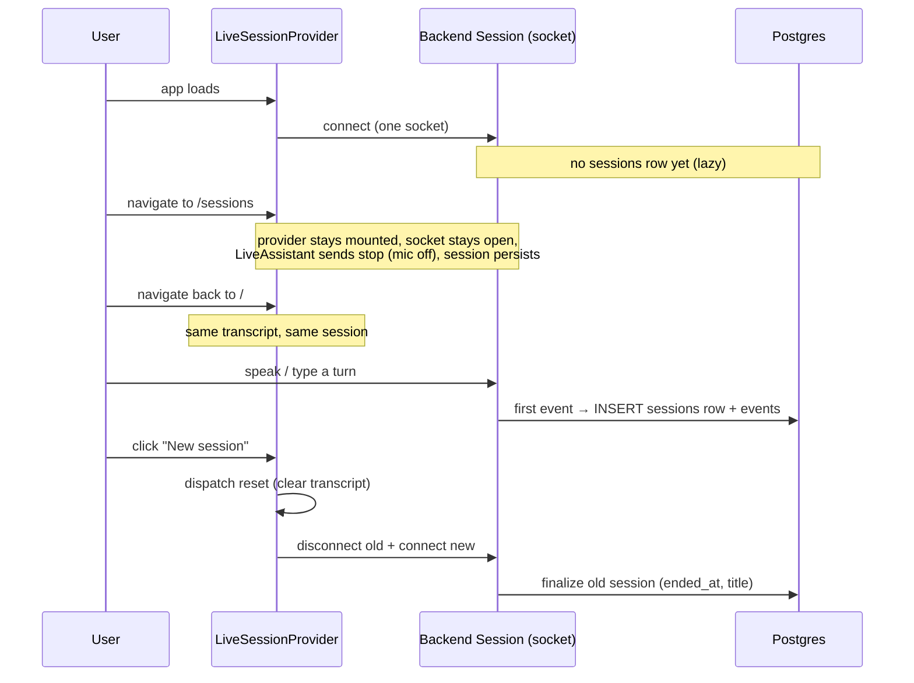

# Live Session Persistence — Design

**Date:** 2026-07-13
**Status:** Approved (pending spec review)

## Problem

Every visit to the Live page (`/`) creates a brand-new session, and the
Sessions list fills with "(untitled session)" rows.

Root cause:

- `LiveAssistant` opens its `VoiceAssistantClient` inside a mount effect
  ([`LiveAssistant.tsx:16`](../../../frontend/src/routes/LiveAssistant.tsx)).
  Navigating away unmounts the component and closes the socket; navigating
  back mounts it again and opens a new one.
- On the backend, each WebSocket connection constructs `Session(websocket)`
  with a fresh `uuid.uuid4()` and `EventRecorder.start()` inserts the
  `sessions` row **on connect**, before any turn happens
  ([`events.py:50`](../../../backend/src/voice_assistant/events.py)). That is
  why empty connections still show up as "(untitled session)".
- The conversation's memory (`input_items`) lives on that `Session` object,
  so a new session is also a blank-slate conversation.
- In dev, React StrictMode double-invokes the mount effect (connect →
  cleanup → connect), producing an extra throwaway empty session per load.

## Goals

- Navigating **Live ⇄ Sessions and back** keeps the same session and the
  same conversation context.
- An explicit **"New session"** control starts a fresh session on demand.
- Connections where the user never said anything leave **no** session row
  behind.

## Non-goals

- Surviving a full browser refresh (F5) or tab close/reopen. A reload starts
  a fresh session; this is acceptable (confirmed with the requester). That
  would require the backend to accept a session id and rehydrate history from
  the event log — out of scope.
- Any change to the WebSocket protocol, the agent loop, or the replay path.

## Design

### 1. Persist the connection above the router (frontend)

Lift the connection and UI state out of the `LiveAssistant` route into a
context provider mounted **above** `<Routes>`, so route changes never unmount
it.

**New `frontend/src/LiveSessionContext.tsx`** — a `LiveSessionProvider` that
owns, for the life of the page:

- the single `VoiceAssistantClient` (connected once on mount),
- the `useReducer(reducer, initialState)` state and `dispatch`,
- the `AudioPlayer`,
- `connectionStatus`.

It exposes via context: `state`, `dispatch`, `client`, `connectionStatus`,
and `newSession()`.

**`App.tsx`** wraps the route switch:

```tsx
<BrowserRouter>
  <LiveSessionProvider>
    <Routes>…</Routes>
  </LiveSessionProvider>
</BrowserRouter>
```

Because the provider sits above `<Routes>`, switching `/ ⇄ /sessions` leaves
it mounted — the socket, the transcript, and `input_items` (backend-side) all
survive.

**`LiveAssistant.tsx`** no longer owns the client/state/effect; it reads them
from the context via a `useLiveSession()` hook. Its markup (transcript, mic
button, input row) is unchanged.

### 2. "New session" button

A button in the Live header, next to the existing "Sessions" link. It calls
`newSession()`:

1. `dispatch({ type: 'reset' })` — clears the transcript/tool activity/
   notifications/error back to `initialState`.
2. `client.disconnect()` then `client.connect()` — closes the current socket
   (backend finalizes the old session) and opens a new one (backend mints a
   fresh session). The incoming `ready` event sets the new `session_id`.

`VoiceAssistantClient` already supports reconnect: `disconnect()` nulls the
socket and `connect()` guards on `this.socket` being null, so the same
instance can be reused.

**`state.ts`** gains one local action:

```ts
case 'reset': return initialState
```

added to the `LocalAction` union. Purely additive — no existing case changes.

### 3. Stop the mic when leaving Live (frontend)

Keeping the socket open across navigation means STT capture would otherwise
keep running in the background while the user is on the Sessions page. To
avoid background listening, `LiveAssistant`'s unmount sends a `stop` frame
(guarded on the socket being open) **without** disconnecting. The backend's
`stop` handler tears down STT and settles to idle but leaves the session and
socket alive ([`session.py:536`](../../../backend/src/voice_assistant/session.py)).
`_stop_stt()` is a no-op when no capture is active, so this is always safe.
Returning to Live shows the same transcript; the user restarts the mic if
they want.

### 4. Lazy session creation (backend)

Defer the `sessions` row insert from connect-time to first-event-time, in
[`events.py`](../../../backend/src/voice_assistant/events.py):

- `start()` — probe DB reachability with a lightweight query (e.g. a
  `SELECT 1`) to decide `_enabled` and launch the flush loop, but **do not**
  insert the session row. Preserves the existing "self-disable when Postgres
  is unreachable" behavior.
- `_write_batch()` — before inserting event rows, ensure the `sessions` row
  exists (insert `SessionRow(id=…)` with `ON CONFLICT DO NOTHING`, guarded by
  a `_session_created` flag set to `True` only after a successful commit). The
  events FK (`events.session_id → sessions.id`) is therefore always
  satisfied.
- `stop()` — after draining the flush loop, only run the finalizing
  `UPDATE … SET ended_at, title` when `_session_created` is `True`. A
  connection that produced no events leaves no row at all.

`note_title()` is called at the start of a real turn, immediately before that
turn's events are emitted, so any genuine turn always creates the row and the
title/`ended_at` update in `stop()` applies as before. `started_at` (server
default `now()`) now reflects the first-turn time rather than connect time —
a more meaningful value, and the API's `order_by(started_at desc)` is
unaffected.

This makes empty-session cleanup robust regardless of frontend timing: idle
page loads, refreshes without talking, and StrictMode's dev double-connect
all leave nothing behind.

## Data flow (after)



## Testing

- **`state.test.ts`** — add a case asserting `reducer(populatedState,
  { type: 'reset' })` deep-equals `initialState`.
- **`test_events.py`** — update existing assertions that expect a `sessions`
  row on `start()`; add: (a) a recorder that starts and stops with **no**
  recorded events writes **no** `sessions` row; (b) a recorder that records at
  least one event creates the row exactly once and `stop()` finalizes
  `ended_at`/`title`.
- **Typecheck / lint** — `make lint` (tsc + ruff) must pass after the context
  refactor.
- **Manual** — via the browser preview: load Live, type a turn, go to
  Sessions and back (transcript intact, one session row), click New Session
  (transcript clears, a second row appears only after the next turn).

## Risks / trade-offs

- **State now lives longer than a route.** The provider is the single owner;
  `LiveAssistant` must not re-create a client. Mitigated by the client living
  only in the provider.
- **A reload still starts fresh.** Accepted per non-goals.
- **`started_at` semantics shift** from connect-time to first-turn-time. This
  is intended and improves the Sessions list (timestamps reflect real
  conversations).
